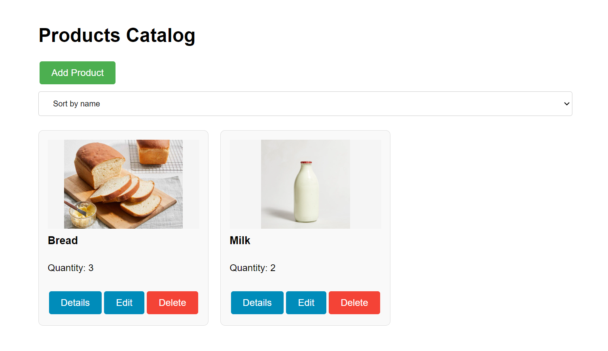

# Shopping App

A product catalog web application built with React, Redux, and MongoDB.



## Features

- View a list of products in a responsive grid layout
- Sort products by name or quantity
- Add new products with validation
- Edit existing product details
- Delete products
- View detailed product information
- Add and delete comments on products

## Technology Stack

### Frontend

- React 19
- Redux
- Vite for fast development and building

### Backend

- Node.js with Express
- MongoDB with Mongoose for data persistence
- RESTful API architecture

## Getting Started

### Prerequisites

- Node.js (v14 or higher)
- MongoDB (local installation or MongoDB Atlas)

### Installation

1. Clone the repository:

   ```
   git clone <repository-url>
   cd shopping-app
   ```

2. Install backend dependencies:

   ```
   cd backend
   npm install
   ```

3. Install frontend dependencies:
   ```
   cd ../frontend
   npm install
   ```

### Running the Application

1. Start MongoDB service (if using local MongoDB)

2. Start the backend server:

   ```
   cd backend
   npm run dev
   ```

3. Start the frontend development server:

   ```
   cd ../frontend
   npm run dev
   ```

4. Open your browser and navigate to:
   ```
   http://localhost:5173
   ```

## API Endpoints

- `GET /products?sortBy=name` - Get all products sorted by name or quantity
- `POST /products` - Create a new product
- `PUT /products/:id` - Update an existing product
- `DELETE /products/:id` - Delete a product
- `POST /products/:id/comments` - Add a comment to a product
